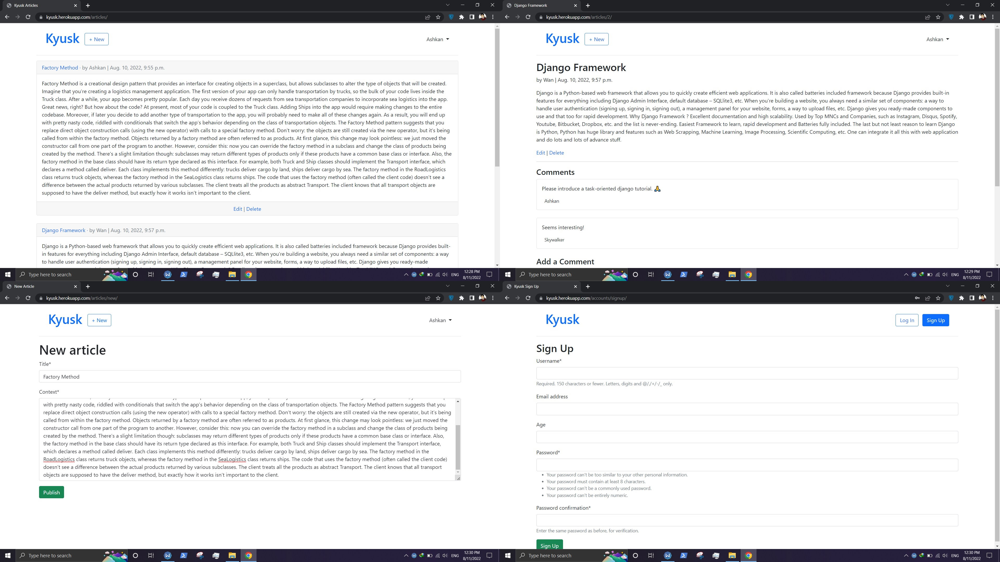

# Kyusk

Journalism application, developed with [Django](https://github.com/django/django), using [PostgreSQL](https://www.postgresql.org/).

Available on [kyusk.herokuapp.com](https://kyusk.herokuapp.com/)

> Use VPN to visit kyusk.herokuapp.com.

## features

Authentication: users can create account and login to the application.

Articles: create, read, update and delete functionalities has been implemented for articles. users can publish articles after authentication. edit and delete option of article are only available for its author.

Comments: users can comment on articles after authentication.

Admin: dashboard implemented using django admin app which can be used to manage users, articles, comments etc.
